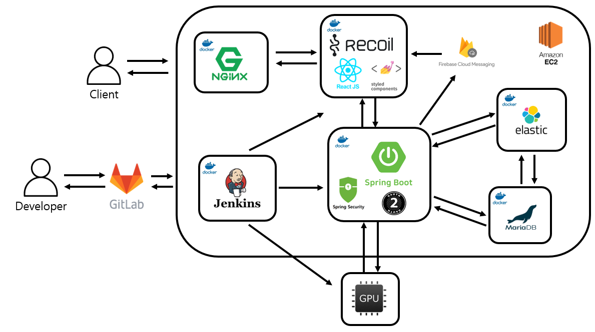
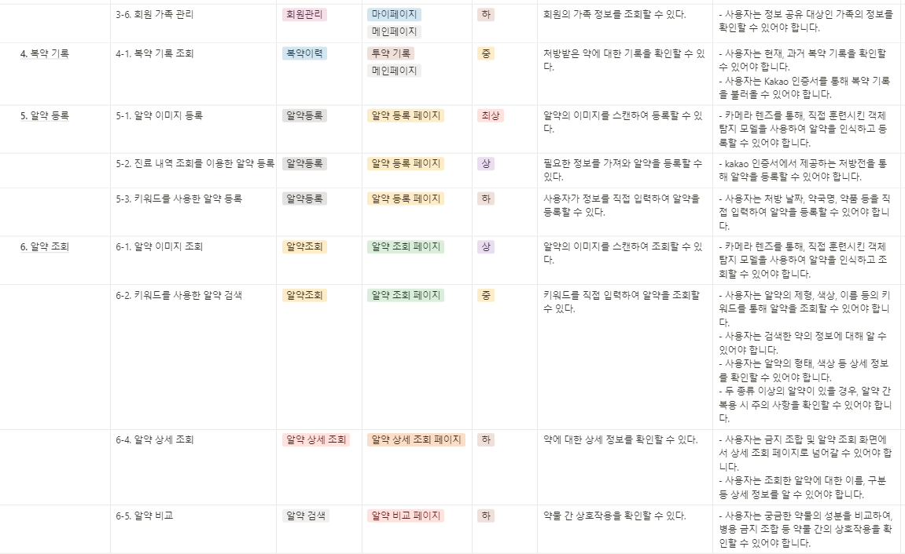
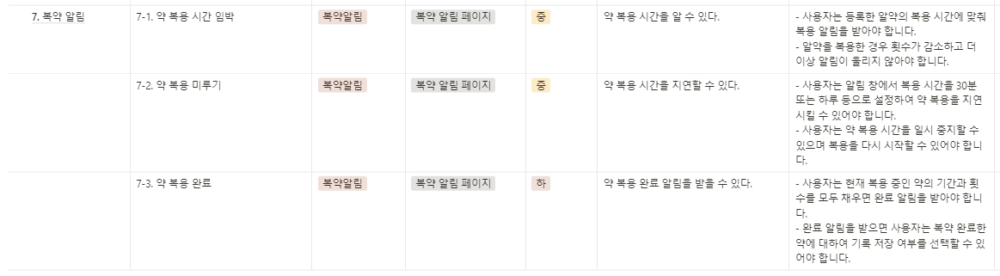
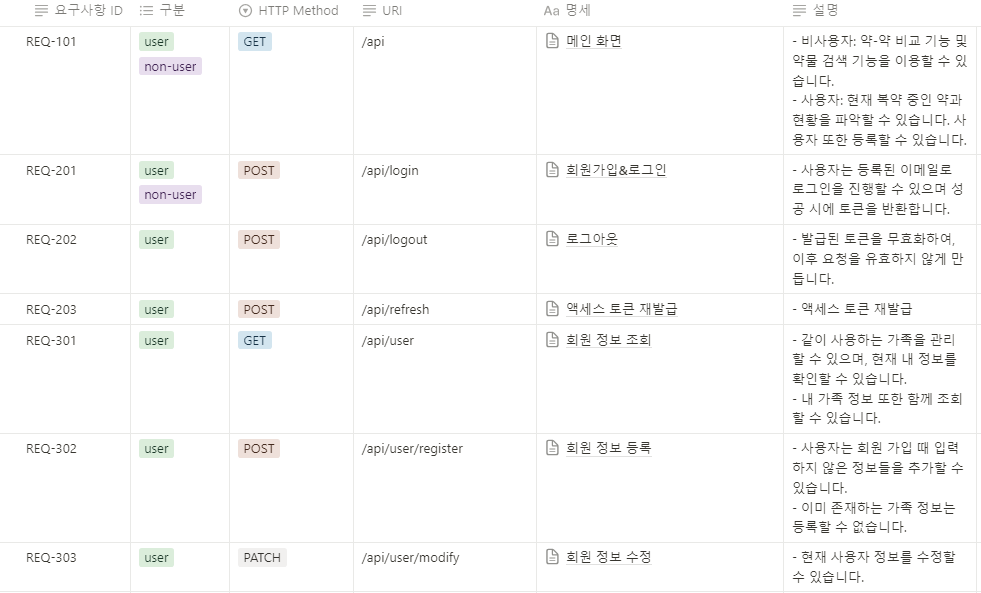
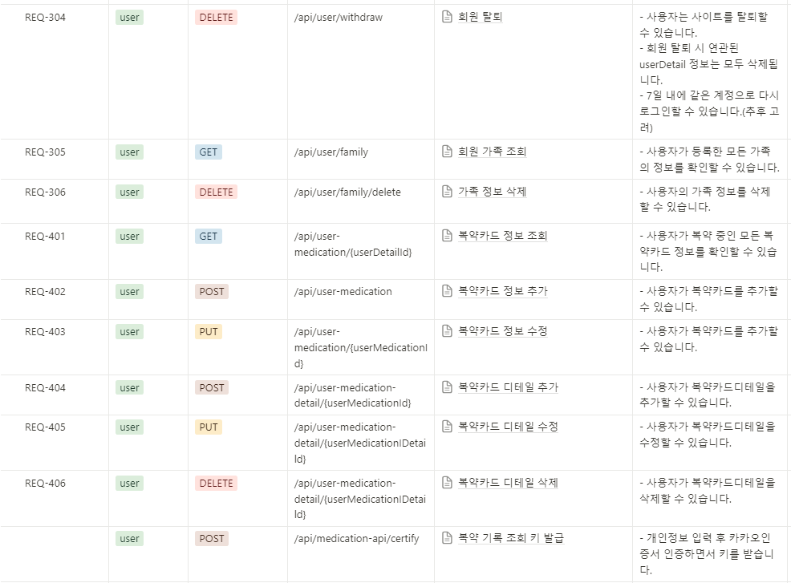
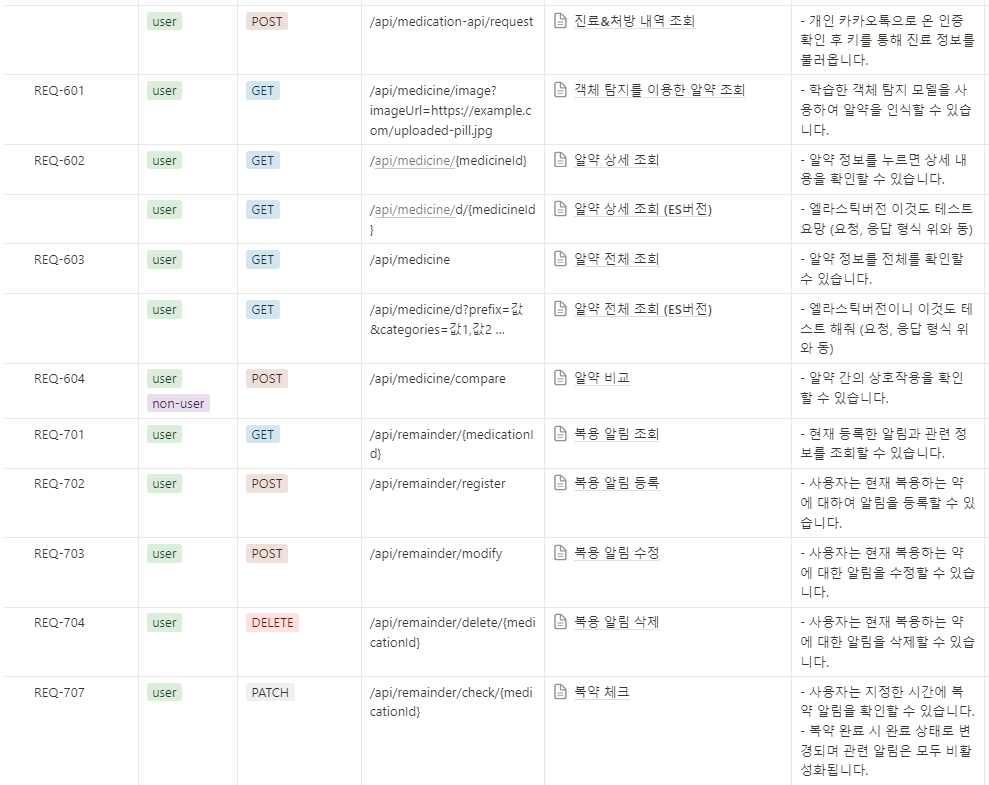
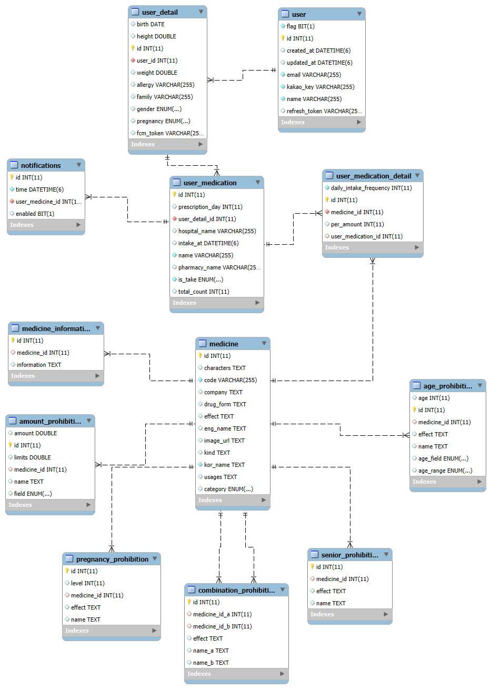

# 프로젝트 - 필쏘굿 (Pill So Good)

## 💡 UCC

 
 

## 🚩 목차

1. 프로젝트 소개
2. 기획 배경
3. 기능 소개
4. 사용 기술 & 아키텍쳐
5. 프로젝트 기획
6. 프로젝트 산출물
7. 프로젝트 회고
 
 

## ✨ 1. 프로젝트 소개

### 개요

- 한 줄 설명 : 복용 중인 여러 약물의 안전한 복용 정보를 제공하는 서비스
- 서비스명 : **Pill So Good**
- 인원 : 6인
- 기간 : 2024.08.26 ~ 2024.10.11
- 팀원 정보

| 이름   | 역할           |
| ------ | -------------- |
| 최용훈 | 팀장, Back-End        |
| 정경원 | Back-End리더, Infra  |
| 한지훈 | Back-End, AI  |
| 이용성 | Front-End리더 |
| 장유진 | Front-End |
| 박선민 | Front-End |
 

### 기능

| 항목               | 내용                                                                                                      |
| ------------------ | --------------------------------------------------------------------------------------------------------- |
| **알약 인식 및 등록**  | 사용자가 알약이나 처방전 사진을 찍으면, 이미지 인식 기술을 통해 약물 정보를 자동으로 인식하고 등록합니다. |
| **내 진료 & 처방 내역 조회**  | 카카오인증서를 활용하여 사용자의 과거 진료 & 처방 내역을 조회할 수 있습니다. |
| **알약 정보 & 금기 정보 안내** | 약물의 정보와 금기되는 대상 여부에 대한 정보를 제공합니다.               |
| **복용량 안내**        | 사용자가 입력한 약물의 복용량을 기반으로, 하루에 얼마까지 복용해도 되는지를 안내합니다.                   |
| **상호작용 정보 제공** | 등록된 약물들 간의 상호작용 여부를 분석하여, 함께 복용해도 되는지에 대한 정보를 제공합니다.               |
| **복용 알림**          | 사용자가 설정한 복용 스케줄에 따라 알림 기능을 제공하여, 복용 시간을 놓치지 않도록 돕습니다.              |
| **가족 복약 관리**          | 한 계정에 가족들의 정보를 입력하고 한꺼번에 관리할 수 있습니다.              |
 

### 기대효과

- 사용자는 약물 복용에 대한 불안감을 줄이고, 안전하게 복용할 수 있는 정보를 제공합니다.
- 알약 인식, 처방전 스캔, 개인인증서 기능을 활용하여 약을 손쉽게 서비스에 등록할 수 있어 편리합니다.
- 보유 중인 약들의 정보, 금기정보, 병용금기정보를 손쉽게 얻을 수 있습니다.
- 약물 복용 시간에 알림을 받을 수 있어 규칙적으로 약을 복용할 수 있습니다.
- 가족들의 복약 정보를 하나의 계정에서 손쉽게 관리할 수 있습니다.
 
 

## ✨ 2. 기획 배경

### 페르소나

<table>
  <tr>
    <td style="text-align: center;">이름</td>
    <td style="text-align: center;">배경</td>
    <td style="text-align: center;">니즈</td>
    <td style="text-align: center;">목표</td>
  </tr>
  <tr>
    <td> 김민수 (45세, 남성, 만성질환자) </td>
    <td> 김민수 씨는 고혈압과 당뇨병을 앓고 있어, 여러 약물을 장기간 복용해야 합니다. 그는 일상생활이 바쁘다 보니 종종 약 복용을 잊거나, 병용 약물의 부작용에 대해 걱정이 많습니다. </td>
    <td> 복용 중인 약물의 안전성 검토, 복약 시간을 잊지 않도록 알림 기능, 약물 상호작용 위험에 대한 안내 </td>
    <td> 약물 복용을 안전하게 관리하고, 복약 시간을 잘 지켜 건강 상태를 개선하는 것. </td>
  </tr>
  <tr>
    <td> 이지영 (32세, 여성, 임산부) </td>
    <td> 이지영 씨는 임신 6개월 차로, 임신 중에 복용할 수 있는 약물에 대해 많은 관심과 걱정을 가지고 있습니다. 특히, 평소 앓고 있는 편두통 약이 태아에게 미칠 영향이 걱정됩니다. </td>
    <td> 임신 중 안전한 약물 복용 안내, 
복약 정보에 대한 쉽게 접근할 수 있는 정보 제공, 
복용 약물과 임신 상태를 기반으로 한 안전성 검토 </td>
    <td> 임신 중에도 안전하게 약물을 복용하고, 태아의 건강을 지키는 것. </td>
  </tr>
  <tr>
    <td> 박성준 (70세, 남성, 고령자) </td>
    <td> 박성준 씨는 고령자로, 복용해야 하는 약이 많습니다. 하지만 약물의 이름을 헷갈리거나, 복약 시간과 용량을 잊어버리기 쉽습니다. 그는 간단한 사용법으로 모든 복약 정보를 관리하고 싶어 합니다. </td>
    <td> 약물 이름과 복용 방법을 쉽게 관리할 수 있는 시스템, 
복약 알림 기능, 
약물 상호작용에 대한 간단한 안내 </td>
    <td> 혼동 없이 약물을 정확하게 복용하고, 약물 상호작용으로 인한 문제를 피하는 것. </td>
  </tr>
  <tr>
    <td> 정은영 (28세, 여성, 알러지 환자) </td>
    <td> 정은영 씨는 특정 성분에 심각한 알러지가 있어, 약물 복용 시 항상 주의를 기울입니다. 그녀는 자신이 복용할 수 있는 약물인지 여부를 빠르고 정확하게 확인하고 싶어 합니다. </td>
    <td> 특정 성분에 대한 알러지 위험성 안내, 
약물 등록 후, 알러지 성분 포함 여부 자동 확인, 
약국으로 빠르게 문의할 수 있는 기능 </td>
    <td> 알러지 위험을 피하고, 안전하게 약을 복용하는 것. </td>
  </tr>
</table>
 

  ### 현 상황

- [같이 먹으면 안 돼…코로나 치료제와 병용 금기 '세인트존스워트'란?](https://www.mkhealth.co.kr/news/articleView.html?idxno=61112)
- [임산부는 먹으면 안 되는 여드름 치료제, ‘이런’ 사람도 금기?](https://www.hidoc.co.kr/healthstory/news/C0000750603)
 
 

## ✨ 3. 기능 소개

### AI를 활용한 알약 탐지
- **설명**
이미지
 

### OCR을 활용한 약봉투&처방전 탐지
- **설명**
이미지
 

### 개인인증서를 통한 진료&처방내역 조회
- **설명**
이미지
 

### ElasticSearch를 이용한 약 정보 조회
- **설명**
이미지
 

### FCM을 활용한 복약알림 기능
- **설명**
이미지
 

### 가족 복약정보 관리
- **설명**
이미지
 
 

## ✨ 4. 사용 기술 & 아키텍쳐

### 기술 스택

- **프론트엔드** : React, JavaScript, Styled-Components, PWA, Recoil
- **백엔드** : SpringBoot, SpringSecurity, Oauth2.0, FireBase
- **DB** : MariaDB, ElasticSearch
- **AI** : Pytorch, FasAPI, RestNet50
- **인프라** : Docker, Nginx, Jenkins, Ubuntu
- **이슈 관리** : JIRA, GitLab, Notion
 

### 아키텍쳐

&emsp; 
 

## ✨ 5. 프로젝트 기획

### 기능명세서

&emsp;  &emsp; 
&emsp; 
 

###	API명세서

&emsp;  &emsp; 
&emsp;  &emsp; 
 

###	피그마

&emsp; 
 

###	ERD

&emsp; &emsp; 
 

## ✨ 6. 프로젝트 산출물

### 화면(알약인지, OCR, 개인인증서, 소셜로그인, ES성능비교 포함)
 
 

## ✨ 7. 프로젝트 회고

| :이름: | :역할: | :소감: |
| :-: | :-------------: | -------------------------------------------------------------------------------------------------------------------------------------------------------------------------------------------------------------------------------------------------------------------------------------------------------------------------------------------------------------------------------------------------------------------------------------------------------------------- |
|    최용훈 |    팀장, Back-End     | 공ㅇㅇㅇㅇㅇㅇㅇㅇㅇㅇㅇㅇㅇㅇㅇㅇㅇㅇㅇㅇㅇㅇㅇㅇㅇㅇㅇㅇㅇㅇㅇㅇㅇㅇㅇㅇ란 |
|    정경원 | Back-End리더, Infra | 공란 |
|    한지훈 |     Back-End, AI      | 공란 |
|    이용성 |     Front-End리더     | 공란 |
|    장유진 |       Front-End        | 공란 |
|    박선민 |       Front-End        | 공란 |
  

<table>
  <tr>
    <td style="text-align:center;">
        최용훈  팀장, Back-End  공란
    </td>
    <td style="text-align:center;">
        정경원  Back-End리더, Infra  공란
    </td>
    <td style="text-align:center;">
        한지훈  Back-End, AI  공란
    </td>
  </tr>
  <tr>
    <td style="text-align:center;">
        이용성  Front-End리더  공란
    </td>
    <td style="text-align:center;">
        장유진  Front-End  공란
    </td>
    <td style="text-align:center;">
        박선민  Front-End  공란
    </td>
  </tr>
</table>

