# 프로젝트 - 필쏘굿 (Pill So Good)

## 💡 UCC

 
 

## 🚩 목차

1. 프로젝트 소개
2. 기획 배경
3. 기능 소개
4. 사용 기술 & 아키텍쳐
5. 프로젝트 기획
6. 프로젝트 산출물
7. 프로젝트 회고
 
 

## ✨ 1. 프로젝트 소개

### 개요

- 한 줄 설명 : 복용 중인 여러 약물의 안전한 복용 정보를 제공하는 서비스
- 서비스명 : **Pill So Good**
- 인원 : 6인
- 기간 : 2024.08.26 ~ 2024.10.11
- 팀원 정보

| 이름   | 역할           |
| ------ | -------------- |
| 최용훈 | 팀장, Back-End        |
| 정경원 | Back-End리더, Infra  |
| 한지훈 | Back-End, AI  |
| 이용성 | Front-End리더 |
| 장유진 | Front-End |
| 박선민 | Front-End |
 

### 기능

| 항목               | 내용                                                                                                      |
| ------------------ | --------------------------------------------------------------------------------------------------------- |
| **알약 인식 및 등록**  | 사용자가 알약이나 처방전 사진을 찍으면, 이미지 인식 기술을 통해 약물 정보를 자동으로 인식하고 등록합니다. |
| **내 진료 & 처방 내역 조회**  | 카카오인증서를 활용하여 사용자의 과거 진료 & 처방 내역을 조회할 수 있습니다. |
| **알약 정보 & 금기 정보 안내** | 약물의 정보와 금기되는 대상 여부에 대한 정보를 제공합니다.               |
| **복용량 안내**        | 사용자가 입력한 약물의 복용량을 기반으로, 하루에 얼마까지 복용해도 되는지를 안내합니다.                   |
| **상호작용 정보 제공** | 등록된 약물들 간의 상호작용 여부를 분석하여, 함께 복용해도 되는지에 대한 정보를 제공합니다.               |
| **복용 알림**          | 사용자가 설정한 복용 스케줄에 따라 알림 기능을 제공하여, 복용 시간을 놓치지 않도록 돕습니다.              |
| **가족 복약 관리**          | 한 계정에 가족들의 정보를 입력하고 한꺼번에 관리할 수 있습니다.              |
 

### 기대효과

- 사용자는 약물 복용에 대한 불안감을 줄이고, 안전하게 복용할 수 있는 정보를 제공합니다.
- 알약 인식, 처방전 스캔, 개인인증서 기능을 활용하여 약을 손쉽게 서비스에 등록할 수 있어 편리합니다.
- 보유 중인 약들의 정보, 금기정보, 병용금기정보를 손쉽게 얻을 수 있습니다.
- 약물 복용 시간에 알림을 받을 수 있어 규칙적으로 약을 복용할 수 있습니다.
- 가족들의 복약 정보를 하나의 계정에서 손쉽게 관리할 수 있습니다.
 
 

## ✨ 2. 기획 배경

### 페르소나

<table>
  <tr>
    <td style="text-align: center;">이름</td>
    <td style="text-align: center;">배경</td>
    <td style="text-align: center;">니즈</td>
    <td style="text-align: center;">목표</td>
  </tr>
  <tr>
    <td> 김민수 (45세, 남성, 만성질환자) </td>
    <td> 김민수 씨는 고혈압과 당뇨병을 앓고 있어, 여러 약물을 장기간 복용해야 합니다. 그는 일상생활이 바쁘다 보니 종종 약 복용을 잊거나, 병용 약물의 부작용에 대해 걱정이 많습니다. </td>
    <td> 복용 중인 약물의 안전성 검토, 복약 시간을 잊지 않도록 알림 기능, 약물 상호작용 위험에 대한 안내 </td>
    <td> 약물 복용을 안전하게 관리하고, 복약 시간을 잘 지켜 건강 상태를 개선하는 것. </td>
  </tr>
  <tr>
    <td> 이지영 (32세, 여성, 임산부) </td>
    <td> 이지영 씨는 임신 6개월 차로, 임신 중에 복용할 수 있는 약물에 대해 많은 관심과 걱정을 가지고 있습니다. 특히, 평소 앓고 있는 편두통 약이 태아에게 미칠 영향이 걱정됩니다. </td>
    <td> 임신 중 안전한 약물 복용 안내, 
복약 정보에 대한 쉽게 접근할 수 있는 정보 제공, 
복용 약물과 임신 상태를 기반으로 한 안전성 검토 </td>
    <td> 임신 중에도 안전하게 약물을 복용하고, 태아의 건강을 지키는 것. </td>
  </tr>
  <tr>
    <td> 박성준 (70세, 남성, 고령자) </td>
    <td> 박성준 씨는 고령자로, 복용해야 하는 약이 많습니다. 하지만 약물의 이름을 헷갈리거나, 복약 시간과 용량을 잊어버리기 쉽습니다. 그는 간단한 사용법으로 모든 복약 정보를 관리하고 싶어 합니다. </td>
    <td> 약물 이름과 복용 방법을 쉽게 관리할 수 있는 시스템, 
복약 알림 기능, 
약물 상호작용에 대한 간단한 안내 </td>
    <td> 혼동 없이 약물을 정확하게 복용하고, 약물 상호작용으로 인한 문제를 피하는 것. </td>
  </tr>
  <tr>
    <td> 정은영 (28세, 여성, 알러지 환자) </td>
    <td> 정은영 씨는 특정 성분에 심각한 알러지가 있어, 약물 복용 시 항상 주의를 기울입니다. 그녀는 자신이 복용할 수 있는 약물인지 여부를 빠르고 정확하게 확인하고 싶어 합니다. </td>
    <td> 특정 성분에 대한 알러지 위험성 안내, 
약물 등록 후, 알러지 성분 포함 여부 자동 확인, 
약국으로 빠르게 문의할 수 있는 기능 </td>
    <td> 알러지 위험을 피하고, 안전하게 약을 복용하는 것. </td>
  </tr>
</table>
 

  ### 현 상황

- [같이 먹으면 안 돼…코로나 치료제와 병용 금기 '세인트존스워트'란?](https://www.mkhealth.co.kr/news/articleView.html?idxno=61112)
- [임산부는 먹으면 안 되는 여드름 치료제, ‘이런’ 사람도 금기?](https://www.hidoc.co.kr/healthstory/news/C0000750603)
 
 

## ✨ 3. 특화 기능 소개

### AI를 활용한 알약 탐지
- ResNet 50 모델 사용
- 34에 비해 더 깊은 네트워크 계층을 가졌기에, 복잡한 이미지에 대한 데이터 학습에 적합하므로 채택
- 처음부터 구현하였지만 성능이 별로 좋지 않았기에, `Pre-Trained` 모델을 가져온 후 `Fine-Tuning`을 이용하여 훈련하는 방법을 채택
- `epoch` (1차:10개, 2차:30개)
- [AI-HUB의 경구약제 이미지(420종, 약 15만개 이미지파일, 1.3TB)](https://aihub.or.kr/aihubdata/data/view.do?currMenu=115&topMenu=100&dataSetSn=576) 
&emsp; 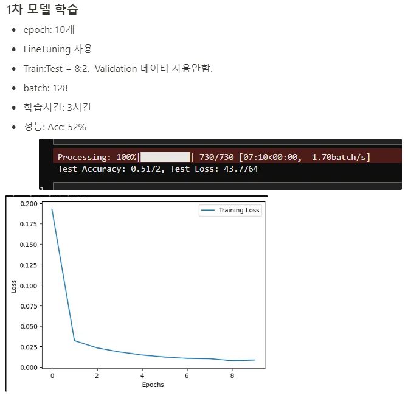 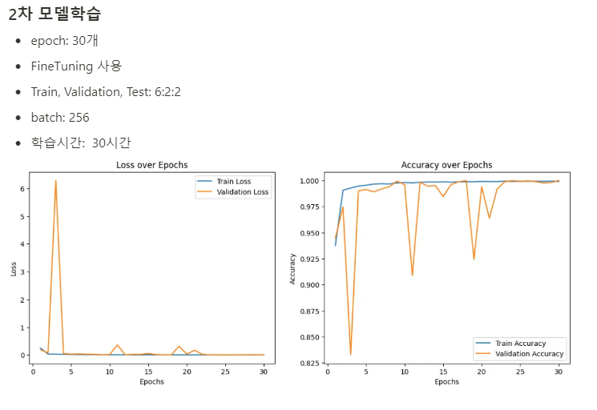 
&emsp; 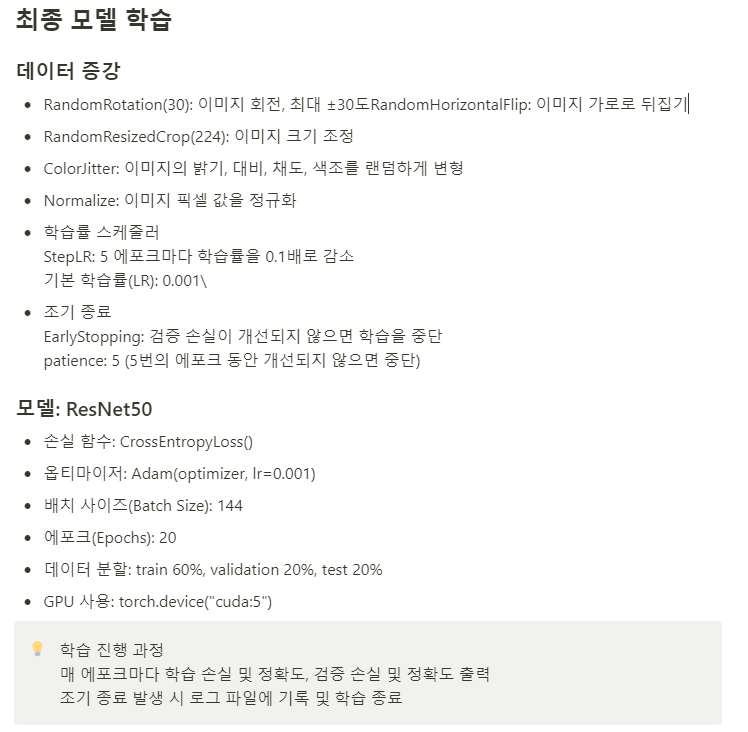 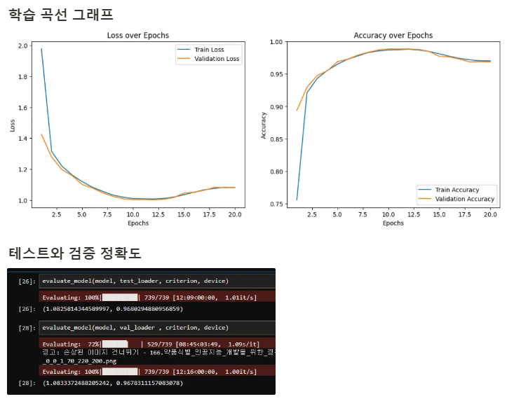
 

### OCR을 활용한 약봉투&처방전 탐지
- 이미지를 촬영하여 원본 이미지와 전처리한 이미지를 네이버 클라우드(ocr)을 이용하여 약 정보를 분석한다
- '정', '캡슐', '정제' 와 같은 단어가 포함되었을 경우 의약품으로 간주한다
- 출력된 약물 정보는 저장된 데이터에 검색 후, 유효한 정보만 약물 카드에 등록되도록 한다 
&emsp; 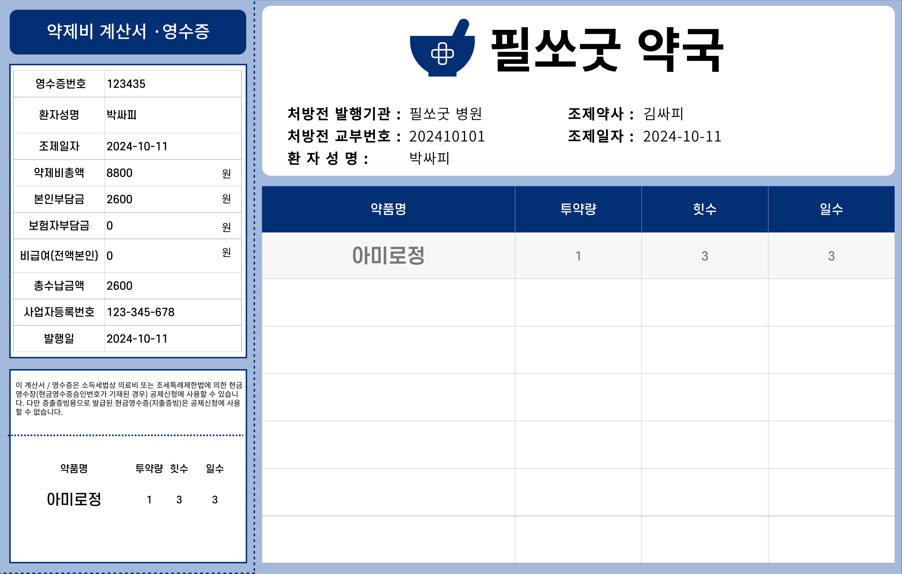 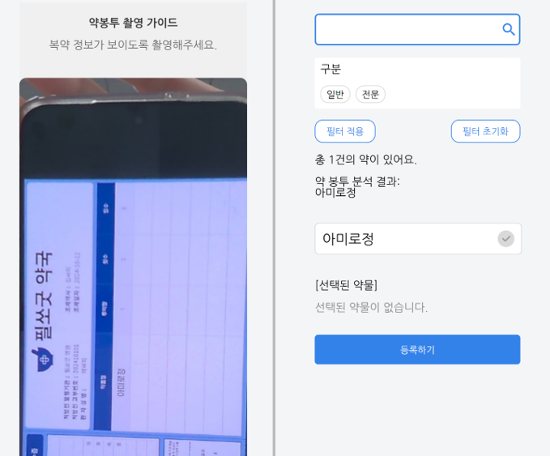
 

### 개인인증서를 통한 진료 & 처방내역 조회
- 카카오 개인인증서를 통해 개인 진료 & 처방 내역 조회
- 개인정보를 입력하면 암호화를 통해 데이터허브에 요청을 보내 callbackId를 받음
- callbackId로 진료 & 처방 내역을 JSON으로 받고, 파싱을 통해 저장 
&emsp; 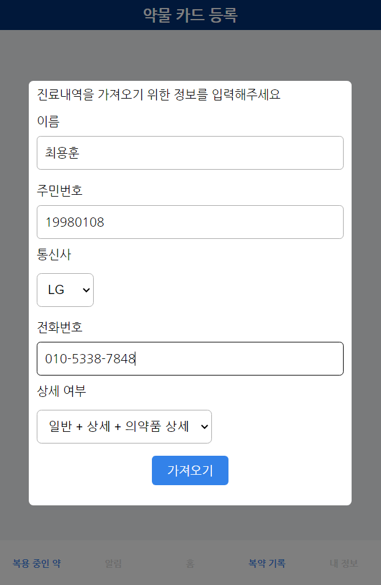 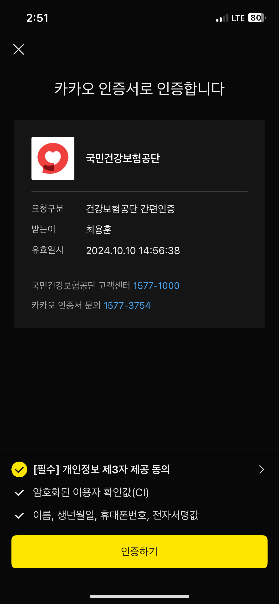 
 

### ElasticSearch를 이용한 약 정보 조회
- 엘라스틱 서치를 이용한 약 정보 조회 성능 개선
- ELK 스택을 통해 인덱싱, 시각화, RDBMS와 연동
- 실시간으로 검색어와 카테고리가 검색 결과에 반영
- 일반 조회와 엘라스틱 조회의 성능 비교를 통해 개선효과 체감(약 90%) 
&emsp;  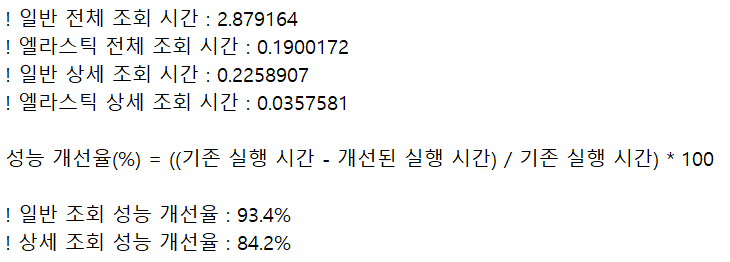
 

### FCM을 활용한 복약알림 기능
- Firebase Cloud Messaging(FCM)을 이용해 사용자에게 복약 시간 알림 전송
- 사용자별 복약 스케줄을 설정하고 지정된 시간대에 알림을 발송함으로써 복약 준수도 향상
- 복약 정보와 사용자 디바이스 토큰을 REST API로 연동하여 알림 메시지 생성 및 전송 
&emsp; 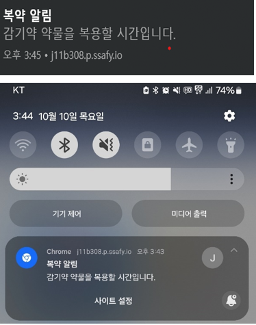 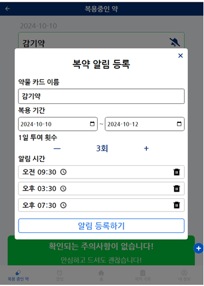
 
 

## ✨ 4. 사용 기술 & 아키텍쳐

### 기술 스택

- **프론트엔드** : React, JavaScript, Styled-Components, PWA, Recoil
- **백엔드** : SpringBoot, SpringSecurity, Oauth2.0, FireBase
- **DB** : MariaDB, ElasticSearch
- **AI** : Pytorch, FasAPI, RestNet50
- **인프라** : Docker, Nginx, Jenkins, Ubuntu
- **이슈 관리** : JIRA, GitLab, Notion
 

### 아키텍쳐

&emsp; 
 

## ✨ 5. 프로젝트 기획

### 기능명세서

&emsp; 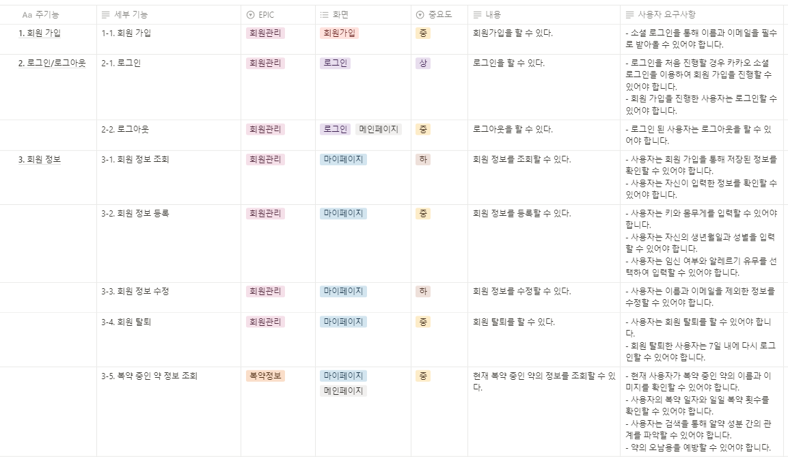 &emsp; 
&emsp; 
 

###	API명세서

&emsp;  &emsp; 
&emsp;  &emsp; 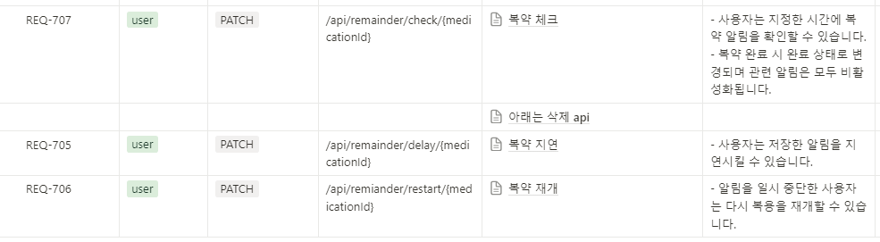
 

###	피그마

&emsp; 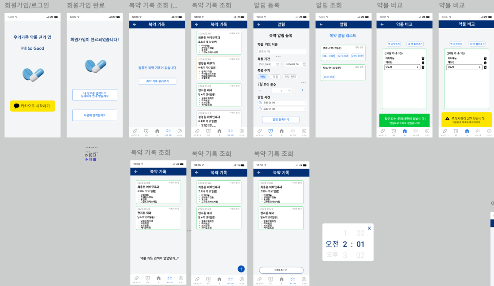
 

###	ERD

&emsp; &emsp; 
 

## ✨ 6. 프로젝트 산출물

### 화면(알약인지, OCR, 개인인증서, 소셜로그인, ES성능비교 포함)
 

|                                                          |                                                          |                                                          |                                                           |
| :------------------------------------------------------: | :------------------------------------------------------: | :------------------------------------------------------: | :-------------------------------------------------------: |
|                      |                   |          |              |
|                          로그인                          |                         회원가입                         |                    홈                    |                        사용자 등록                        |
|  |              |            |                    |
|                     사용자 등록                     |                      사용자 등록                       |                      사용자 등록                       |                        사용자 등록                        |
|           |  |       |      |
|                       사용자 등록                        |                       내 정보                       |                    약 카드                    |                       약 카드                     |
|            |          |             |            |
|                        검색                         |                        검색                         |                        검색                         |                         비교                         |
|           |               |          |               |
|                       등록                      |                         등록                         |                        등록                         |                     등록                     |
|           |            |          |           |
|                       등록                        |                       등록                        |                       등록                        |                         등록                         |
|              |                    |                   |                   |
|                  등록                   |                        알림                         |                         알림                           |                     알림                      |

 

## ✨ 7. 프로젝트 회고

<table>
  <tr>
    <th style="text-align:center;"> 이름 </td>
    <th style="text-align:center;"> 역할 </td>
    <th style="text-align:center;"> 소감 </td>
  </tr>
  <tr>
    <td style="text-align:center;">
       최용훈
    </td>
    <td style="text-align:center;">
      팀장, Back-End
    </td>
    <td>
      공란
    </td>
  </tr>
  <tr>
    <td style="text-align:center;">
       정경원
    </td>
    <td style="text-align:center;">
      Back-End리더, Infra
    </td>
    <td>
      이번 프로젝트는 개인적으로도 큰 성장의 기회였고 팀원들과의 협업을 통해 기술적으로도 그리고 프로젝트 관리 측면에서도 많은 것을 배우고 익힐 수 있었습니다. 프로젝트를 마무리하며 느끼는 점은 기술적 지식뿐만 아니라 협업의 중요성과 사용자 관점에서의 서비스 기획의 중요성입니다. 앞으로도 이 경험을 바탕으로 지속적으로 배워나가며 더 나은 서비스를 제공할 수 있도록 노력하겠습니다.
    </td>
  </tr>
  <tr>
    <td style="text-align:center;">
       한지훈
    </td>
    <td style="text-align:center;">
      Back-End, AI
    </td>
    <td>
      우선 모든 팀원들에게 기획부터 개발, 배포까지의 프로젝트 개발은 모두 고생했다고 말씀드리고 싶습니다.
좋은 팀원들 덕에 충분히 고민하고 배우는 시간을 가질 수 있어 한층 더 성장할 수 있었습니다. 
직접 GPU 서버에 생성형 AI를 학습시키고 배포하여 알약인식시스템을 만들며, 정말 많은 것을 배웠습니다.
팀원분들 다들 고생하면서 프로젝트를 진행하였고, 그만한 결과까지 나와 만족해서 팀원분들께 정말 고맙다고 느꼈습니다.
    </td>
  </tr>
  <tr>
    <td style="text-align:center;">
       이용성
    </td>
    <td style="text-align:center;">
      Front-End리더
    </td>
    <td>
      공란
    </td>
  </tr>
  <tr>
    <td style="text-align:center;">
       장유진
    </td>
    <td style="text-align:center;">
      Front-End
    </td>
    <td>
      공란
    </td>
  </tr>
  <tr>
    <td style="text-align:center;">
       박선민
    </td>
    <td style="text-align:center;">
      Front-End
    </td>
    <td>
      공란
    </td>
  </tr>
</table>
  
